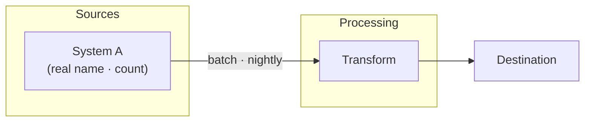

# Diagram Architect

## Overview

Produce **accurate, presentation-quality diagrams** by interviewing the user first, grounding the content in a real source, rendering with the best-fit JS framework into a live HTML preview, and only asking about **export format after the user approves the look**. The failure mode this skill prevents is **guessing** — drawing a plausible-looking architecture that doesn't match what was built, or exporting before the user has seen and approved it.

**Core principle:** Ground first, draw second, **preview → approve → then export**. Don't ask export format up front — ask it only once the user likes the rendered diagram.

## When to Use

- User says: "create a diagram", "draw the architecture", "flow chart", "data flow", "sequence diagram", "ER diagram", "deployment topology", "generate a diagram for X".
- Any request to visualize flow, structure, relationships, sequence, state, or topology.
- Documenting an implemented system, a proposed design, or a process.

**When NOT to use:** simple data charts/plots (bar/line/pie/dashboards) — use the `dataviz` skill. Rendering one trivial box-and-arrow inline in a chat answer needs no interview — just draw it.

## The Intake Interview (REQUIRED — ask before drawing)

Ask these **four questions** in a single batch (use the AskUserQuestion tool if available). Do not start drawing until answered. If the user already answered some in their request, only ask the rest. **Do NOT ask export format here** — that comes after the user approves the preview (see Workflow).

### 1. Diagram type
What kind of diagram? Common types and when each fits:

| Type | Shows | Use for |
|---|---|---|
| **Solution / system architecture** | Components + how they connect across layers/zones | "the whole system", hero slide |
| **Data flow** | How data moves source → transform → destination | ETL, ingestion, unification pipelines |
| **Data model / ERD** | Entities/objects + relationships + cardinality | schemas, DMOs, table relationships |
| **Sequence** | Ordered message exchange between actors over time | API calls, auth handshakes, request/response |
| **Deployment / topology** | Where things physically run (orgs, clouds, envs) | infra, multi-org, network |
| **State machine** | States + transitions | lifecycles, status flows |
| **Process / flowchart** | Steps + decisions | runbooks, business processes |
| **AI / RAG pipeline** | Ingest → index → retrieve → generate → guardrail | LLM/agent grounding flows |

### 2. Detail level
- **High-level (L1)** — zones/layers, ~5–10 boxes, one slide. For executives/overview.
- **Component (L2)** — named components + key connections + a few labels/metrics. For architects/panels.
- **Detailed (L3)** — every object/field/endpoint, cardinalities, protocols, counts. For build/handoff/deep review.

### 3. Grounding — where does the information come from?
The single most important question. Options:
- **A specific file/doc** (e.g. an architecture .md, PLAN, runbook) → **read it before drawing.**
- **The live system** (query the org/cloud, inspect metadata) → gather facts first.
- **A prior diagram** to match/extend.
- **The user will describe it** verbally.
- **Design-only / hypothetical** (nothing to ground on yet — mark it as proposed, not as-built).

**If a grounding source exists, you MUST read/gather it before drawing.** A diagram of an implemented system that wasn't grounded is a guess — say so explicitly if the user declines to provide a source.

### 4. Visual theme / branding
How should it look? Ground the theme the same way you ground the content:
- **Company brand** — a company website URL, brand-guide URL, an existing branded deck/screenshot, a logo image, or a repo path with brand assets/CSS. → **You MUST extract the theme (Company Theming) before drawing.**
- **A prior diagram / this project's existing style** (e.g. a `Diagram_Prompts.html` or a previous slide) → reuse its palette.
- **Neutral / default** — clean modern default (one dark heading color + one bright accent).
- **User specifies** — explicit hex colors / font.

**MANDATORY when a brand is chosen — do NOT skip and do NOT silently use neutral:**
1. If the brand source is a **URL** → call **WebFetch** on it. If a **file/repo/logo** → **Read** it. A company *name with no source* is NOT enough — ask for a URL/logo/repo, or state you're using neutral and why. Never guess a palette from memory.
2. **Extract and echo the theme spec back to the user** before drawing — the actual hex colors, font, and logo you found (e.g. "Using #E31937 red / #000 / Helvetica from tesla.com"). If you couldn't extract them, say so explicitly rather than defaulting.
3. Only draw once the palette is grounded. Apply it to **every** diagram in the set.

> Skipping extraction or defaulting to neutral without saying so is the #1 branding failure. If a brand was requested, the render MUST visibly use the extracted colors/font.

## Render Engine — pick the best framework (Mermaid is NOT the default for architecture)

Render an interactive HTML with the framework best suited to the diagram. **Mermaid is a fallback for small/standard diagrams, not the default for architecture.** Its dagre auto-layout produces ugly results on dense diagrams — huge whitespace gaps, long crossing edges, and clipped node titles. If the diagram is a real system/solution architecture or has more than ~10 nodes or grouped zones, **use React Flow (with ELK layout), not Mermaid.**

| Diagram type | Use this | Why | Load via |
|---|---|---|---|
| **Solution/system architecture, >10 nodes, grouped zones, "hero" diagram** | **React Flow + ELK** (`elkjs`) | Custom styled nodes, grouped containers, orthogonal edge routing, controlled layout — looks designed | `reactflow` + React + `elkjs` via esm.sh/unpkg |
| Data flow, process, RAG pipeline (small, linear) | **Mermaid** *(or React Flow if it needs to look premium)* | Zero-build, fine when it's small | `mermaid` (jsdelivr) |
| Data model / ERD | **Mermaid `erDiagram`** | Native entities + cardinality | `mermaid` |
| Sequence | **Mermaid `sequenceDiagram`** | Purpose-built, clean | `mermaid` |
| State machine | **Mermaid `stateDiagram-v2`** or **XState viz** | Transitions | `mermaid` |
| Large graphs, network, force/relationship maps | **Cytoscape.js** (with `elk`/`cola`) or **D3** | Scales to many nodes, real layouts | `cytoscape` / `d3` |
| Timeline / Gantt | **Mermaid `gantt`** or **vis-timeline** | Time axes | `mermaid` / `vis-timeline` |
| Org chart / tree / mind map | **D3 tree** or **Mermaid `mindmap`** | Hierarchies | `d3` / `mermaid` |

**Decision rule:**
- **> ~10 nodes, OR grouped zones/subgraphs, OR the user wants it to look polished → React Flow + ELK** (or Cytoscape+ELK for very large graphs). Do NOT use plain Mermaid `flowchart` here.
- **Small, linear, throwaway, or a living-doc `.md` → Mermaid** is fine.
- When unsure for architecture, **choose React Flow.** It's the difference between "auto-generated" and "designed."

**Making React Flow look good (not the default gray boxes):** use **ELK layered layout** (`elk.direction: RIGHT`, decent `nodeNode`/`layered.spacing` so nodes don't collide); **custom node types** with the brand palette (rounded cards, soft shadow, header bar, icon); **grouped/parent nodes** for zones with a tinted background + label; **smoothstep/orthogonal edges** with arrowheads and edge labels; `fitView` on load; size each node to its text so **titles never clip**. Match the extracted theme spec (Company Theming) into the node/edge styles.

## Workflow — preview → approve → export

1. **Interview** (the 4 questions above). Batch them. Do NOT ask export format yet.
2. **Ground the CONTENT** — read the named file / query the system / review the prior diagram. Extract real names, counts, relationships. Do not proceed on memory if a source exists.
2b. **Ground the THEME (if a brand was chosen)** — **actually call WebFetch on the URL, or Read the logo/repo/CSS.** Extract hex colors + font + logo and **echo them back to the user.** Do NOT skip this and do NOT silently fall back to neutral (see Company Theming). If no source was given, ask for one or state you're using neutral.
3. **Pick the render engine** for the diagram type (table above).
4. **Build a self-contained HTML** rendering the diagram with that framework + the extracted theme spec (the brand colors/font must be visibly applied). **Label edges** with what flows (protocol, trigger, cadence, "batch" vs "live") — unlabeled arrows are the #1 clarity loss.
5. **Verify against the source** — every box/edge traces to a grounded fact; the brand palette is actually applied. Flag anything inferred or proposed-vs-built.
6. **Validate the render for clipping & artifacts** (see Render Validation) — screenshot the HTML headless, inspect for cut-off text/nodes, overflow, overlaps, broken edges. Fix before showing the user. Do NOT surface a preview you haven't visually checked.
7. **Show the user the HTML output** — write the file and **open a live preview in the IDE where possible** (see IDE Preview), else open in the browser / tell them the path. Present it as a **preview for approval**, not a final deliverable.
8. **Iterate** on their feedback (layout, labels, colors, detail) — re-render **and re-validate** the HTML until they approve.
9. **Only after approval, ask what to export as** — including **bare diagram vs framed page** (see Export options) — produce it, then **re-validate the exported artifact** (a PDF/PNG can clip, or capture unwanted page chrome/frontmatter, even when the HTML looked fine).

### Export options (ask AFTER approval)

**First ask: bare diagram, or the framed page?** The preview HTML often has chrome —
page title, talking points, headers, legends, and the source may carry frontmatter.
Always ask whether they want:
- **Diagram only (bare)** — just the diagram graphic, nothing else. *(default for slides/embeds)*
- **Framed** — diagram plus its surrounding page/labels/legend.

Then the format:

| Export | Best for | How |
|---|---|---|
| **PNG / JPG** | Slides, docs, Slack | Screenshot the HTML / headless-Chrome render / library `toImage()` |
| **SVG** | Crisp scaling, Figma, print | Mermaid/D3/Cytoscape export SVG; React Flow via `toSvg` |
| **PDF** | Handout, one-pager | Headless Chrome `--print-to-pdf` on the HTML |
| **Standalone HTML** | Interactive share, living doc | The preview file itself |
| **Mermaid/source in .md** | Editable living docs, GitHub | Emit the source block |
| **Embed in deck/site** | Presentation | Hand back the SVG/PNG or an iframe-able HTML |

**How to export the DIAGRAM ONLY (strip all chrome):**
- **Isolate the element, not the page.** Export the diagram node itself, not `document.body`:
  - Mermaid → grab the rendered `<svg>` (the `.mermaid svg`) and save that SVG alone; for PNG, screenshot with a CSS selector clip on the svg's bounding box.
  - React Flow → `toSvg`/`toPng` targeting the `.react-flow__viewport` (call `fitView` first); hide `Panel`/`Controls`/`MiniMap`/`Background` before capture.
  - D3/Cytoscape → serialize the `<svg>` / `cy.png({full:true})` — the graphic only.
- **Never export a source file's YAML frontmatter.** If emitting Mermaid/source, strip any `---` frontmatter block and any surrounding prose — output only the fenced diagram code (or the raw SVG).
- **Bare-page render for PDF/PNG:** render the diagram into a minimal HTML that contains *only* the diagram element (no `<h1>`, talking points, or legend) — or set `@media print { .chrome { display:none } }` and print just the diagram container — then headless-Chrome capture the clipped bounds, not the window.
- **Trim whitespace/margins** to the diagram's true bounding box (`fitView`, tight `viewBox`, `--force-device-scale-factor` for crisp PNG). Re-validate the exported file for clipping (Render Validation).

## IDE Preview — show the render in-editor where possible

Prefer showing the live preview **inside the IDE** so the user doesn't leave the editor:
- **VS Code / Cursor:** write the `.html` and open it — `code --reuse-window <file>` or the built-in **"Open with Live Preview"/Simple Browser** (`workbench.action.webview` / the Live Preview extension) renders HTML in a side panel. For a Mermaid `.md`, the built-in Markdown preview (`markdown.showPreview`) renders diagrams. Suggest the exact command if you can't trigger it directly.
- **JetBrains:** open the HTML with the built-in browser preview.
- **Fallback (any IDE):** open in the system browser (`open`/`xdg-open`/`start <file>`) and print the file path so the user can click it.
- Always still write the file to disk so it persists and can be exported later.

Tell the user which preview you opened (or the path + one-line "open this to preview"). Then treat it as the approval gate (workflow step 7).

## Quick Reference — Mermaid types

```
flowchart LR / TD      → small/linear flows only (NOT dense architecture — use React Flow+ELK)
sequenceDiagram        → API calls, handshakes, request/response
erDiagram              → data model / ERD (entities + cardinality)
stateDiagram-v2        → state machines / lifecycles
C4Context / C4Container→ formal architecture (if C4 wanted)
```

Minimal grounded example (component-level data flow):


## Render Validation — catch clipping & artifacts before showing

A diagram that renders "mostly right" but clips a label or overlaps two nodes reads as broken. Validate the actual pixels, not just the source. **Screenshot the HTML headless and inspect it** — don't trust that valid source = clean render.

**How to capture a screenshot to inspect:**
- Headless Chrome: `chrome --headless --screenshot=/tmp/diag.png --window-size=1600,900 --default-background-color=FFFFFFFF file:///abs/path.html` (give the page a moment / use `--virtual-time-budget=3000` so JS-rendered frameworks finish).
- Or a browser-automation tool (screenshot the opened file). Then **Read the PNG** and look at it.

**Checklist — look for each:**

| Artifact | What to look for | Typical fix |
|---|---|---|
| **Text clipping** | Labels cut off by node/box edges; ellipsis where there shouldn't be | Widen nodes, reduce font, wrap text, `overflow: visible` |
| **Canvas clipping** | Nodes/edges cut at the diagram's outer edge | Fit-to-view (`fitView` / `d3 zoom-to-fit`); add padding/margin; grow viewBox |
| **Node overlap** | Boxes on top of each other; unreadable | Increase layout spacing (rank/node sep); use auto-layout (dagre/elk) |
| **Edge issues** | Arrows crossing through nodes, missing arrowheads, overlapping labels | Reroute (orthogonal/curved), bump edge separation, offset edge labels |
| **Cut edge labels** | Text on a line running off-canvas or under a node | Shorten label, add background, reposition |
| **Overflow / scrollbars** | HTML shows scrollbars = content exceeds viewport | Size container to content; scale down; paginate an L3 into sections |
| **Truncated on export** | PDF/PNG cuts the right/bottom that HTML showed | Set page size/orientation; `fitView`; export at the diagram's true bounds not the window's |
| **Legend/logo collision** | Legend or logo overlapping nodes | Reserve a margin lane; move to an empty corner |
| **Contrast/invisibility** | Light text on light fill; edges invisible on background | Fix per theme accessibility rule (WCAG AA) |
| **Font not loaded** | Fallback/boxed glyphs (brand font failed to load) | Embed/CDN the font; add web-safe fallback |
| **Overlapping at small sizes** | Fine at full size, collides in the slide thumbnail | Test at target display size, not just full res |

**Rule:** if you can't screenshot/inspect in this environment, say so and ask the user to eyeball the preview specifically for clipping/overlap — don't claim it's clean unseen.

## Company Theming — ground the look on a brand

You can theme an entire diagram set to a company's brand so it looks like it came from their design team. Steps:

**1. Extract a theme spec.** Pull brand attributes from whatever the user provides:
- **Website URL / brand guide** → WebFetch it; read the CSS/brand page for hex colors and font family.
- **Logo or screenshot image** → Read the image; sample the dominant/accent colors and note the typeface style.
- **Existing branded deck / prior diagram** → reuse its exact palette and fonts.
- **Just a company name** → use its well-known brand colors if you know them confidently; otherwise ask for a source rather than guessing (a wrong brand color is worse than a neutral one).

**2. Record it as a reusable theme spec** — then apply the SAME spec to every diagram:

| Token | Example | Use |
|---|---|---|
| `--primary` | brand core color | headings, primary boxes |
| `--accent` | bright brand secondary | connectors/arrows, emphasis |
| `--zone-bg` | light tint of primary | group/zone containers |
| `--card` | white / off-white | component cards |
| `--text` | near-black | body text (check contrast) |
| `--font` | brand typeface (web-safe fallback) | all labels |
| `logo` | logo file/URL | corner of HTML/SVG output |

**3. Apply consistently:** white rounded cards + soft shadows; `--primary` headings; `--accent` arrowheads on **every** edge; `--zone-bg` containers; brand font; left-to-right or top-down flow; 16:9-friendly; a legend when edge types differ (batch vs live, sync vs async). Place the logo discreetly (a corner), never overpowering the content.

**4. Accessibility:** verify text/background contrast meets ~WCAG AA even in brand colors; if a brand color fails on white, darken it for text and keep the true brand color for fills only.

**5. Reuse:** save the theme spec (e.g. as a CSS `:root` block or a Mermaid `themeVariables` object) so the whole set — and future diagrams — stay identical. For a reusable style-header + per-diagram-prompt pattern, mirror the project's `data/presentation/Diagram_Prompts.html` if present.

Mermaid honors a theme inline:
```
%%{init: {'theme':'base','themeVariables':{'primaryColor':'#0b3d6b','primaryTextColor':'#fff','lineColor':'#1b7ce0','fontFamily':'BrandFont, Arial'}}}%%
flowchart LR
  ...
```

## Common Mistakes

| Mistake | Fix |
|---|---|
| Drawing before grounding | Read the source / query the system first — always |
| Skipping the detail-level question | L1 vs L3 are totally different diagrams; ask |
| Unlabeled arrows | Label every edge with what flows + how (protocol/trigger/cadence) |
| Presenting a guess as as-built | Mark inferred/proposed elements explicitly |
| Wrong tool for charts | Bar/line/pie → use `dataviz`, not this skill |
| One giant L3 when they wanted L1 | Match altitude to audience; offer to drill down separately |
| Inventing component/object names | Use exact names from the grounding source |
| Guessing a company's brand colors | Extract from URL/logo/deck; if unknown, ask — a wrong brand color is worse than neutral |
| Brand color fails contrast on white | Darken for text; keep true brand color for fills only (WCAG AA) |
| Inconsistent theme across a set | Save one theme spec; apply identically to every diagram |
| Asking export format up front | Ask it only AFTER the user approves the HTML preview |
| Exporting before the user has seen it | Always show the HTML preview and get approval first |
| Dense architecture rendered in plain Mermaid (ugly gaps, crossing edges, clipped titles) | Use React Flow + ELK for >10 nodes / grouped zones / hero diagrams — Mermaid is not the default here |
| Brand requested but render came out neutral | You didn't extract the theme — MUST WebFetch the URL / Read the logo/repo, echo the palette, then apply it |
| Extracted a theme but didn't apply it | The render must visibly use the brand hex/font; verify in step 5 |
| Assuming valid source = clean render | Screenshot and inspect pixels; validate for clipping/overlap before showing |
| Clipped/overlapping nodes shipped as final | Run Render Validation; fit-to-view + auto-layout spacing |
| Export clips what HTML showed | Re-validate the exported PDF/PNG; set page size + export true bounds |
| Claiming "looks good" without seeing it | If you can't screenshot, say so and ask the user to check clipping/overlap |
| Export captured page chrome (title/talking points/legend) | Offer "diagram only (bare)" export; isolate the diagram element, not the page |
| Emitted source with YAML frontmatter | Strip the `---` frontmatter + prose; output only the fenced diagram code or raw SVG |

## Real-World Impact

Grounding an end-to-end data architecture diagram in the actual PLAN/runbooks (not memory) surfaced real specifics — exact object names, record counts, cross-org boundaries — that a generic template would have gotten wrong. The interview also prevents wasted renders: knowing "L1 for a 15-min exec talk" vs "L3 for engineering handoff" up front means one correct diagram instead of three revisions.
